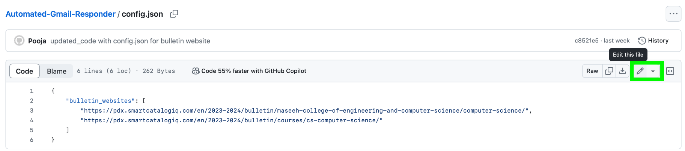
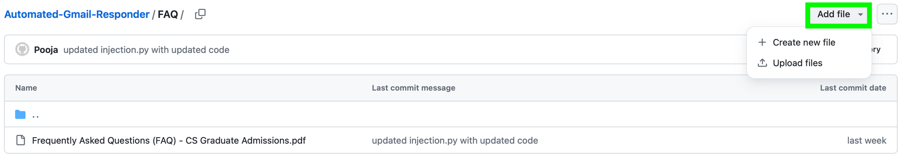
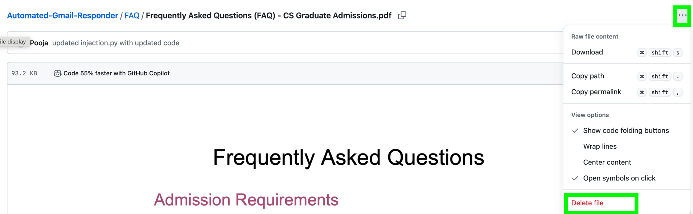

# Automated Gmail Responder

## Overview
This project aims to automate responses to Gmail emails using Langchain. It utilizes the OpenAI API to generate relevant responses to incoming emails.

## Developers
- Pooja Sounder Rajan
- Ana Macavei
- Ben Le
- Josh Li
- Seymour Roberts
- Joseph Nguyen
- Julie Nguyen
- Hilliard Domangue
- Israel Ayala

## Getting Started
To run the project after uploading new documents, follow these steps:

1. Run `python3 ingestion.py`. 
You will be prompted to enter your OpenAI API key.

2. Build the Docker image:
   ```bash
   gcloud builds submit --timeout=900 --tag gcr.io/cs470-rag-llm/capstone
   ```

3. Deploy the Docker image:
    ```bash
    gcloud run deploy capstone --image gcr.io/cs470-rag-llm/capstone --min-instances=1 --memory=1Gi --set-env-vars=OPENAI_API_KEY='YOUR_OPENAI_API_KEY'
    --region=us-west1 --allow-unauthenticated --port=8000
    ```

## Chrome Extension
We have also developed a chrome extension to facilitate easier access to the automated response feature.
Only users who are given the string of our chrome extension would be able to access our extension

## Updating documents
Follow the steps to update the Bulletin: 
Step 1: ctrl+F or cmd+F to word search the website for `config.json`
Step 2: Click on the config.json file
Step 3: Click on the Edit button

Step 4: Replace the URL with the updated URL
Step 5: Then commit the changes. Make sure to select `Commit directly to the main branch`. And then press the green `commit changes button`.

Follow the steps to update the FAQ:
Step 1: Go to FAQ folder
Step 2: Click on `Upload files`

Step 3: Choose your file and then `Commit changes`
Step 4: Delete the older FAQ file by clicking into the file and pressing on the three dots as shown in the screenshot. And select the option to delete the file.



## Acknowledgements


