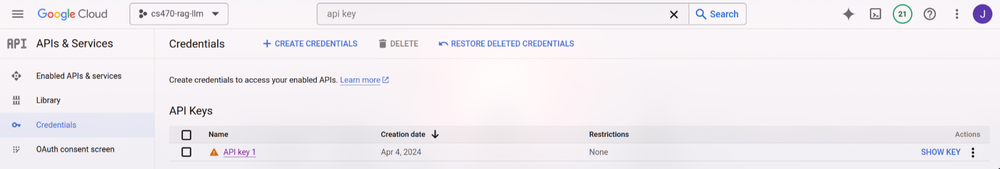
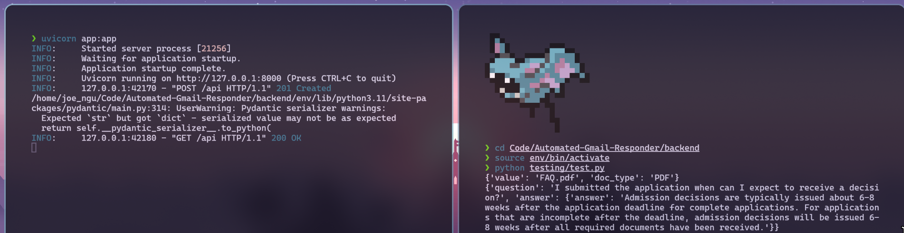

# Automated-Gmail-Responder
The implementation of the Automated Email Responder serves to address the challenge of 
time inefficiency faced by both staff and students. By automatically generating an 
adequate response to frequently asked questions sent in via email, this application 
will save staff members time from the task of individually addressing common questions. 

## Usage
*NOTE: This project requires python version 3.10 and above. You can install the latest version of python [here](https://www.python.org/downloads/)
### Installing Dependencies
#### 1. Create a virtual environment
Go into the backend folder, create a virtual environment using python's inbuilt venv module, and activate it.
Here's what it looks like in linux.
```bash
$ cd backend
$ python -m venv env
$ source env/bin/activate
```

#### 2. Install the dependencies
If you don't have pip already installed on your computer run the following command to install pip:
```bash
$ python -m ensurepip --upgrade
```
Install the dependencies listed in the **requirements.txt** file.
```bash
$ pip install -r requirements.txt
```

### Setup
In the **backend** directory create an `.env` file and initialize it with the following values
```
GOOGLE_API_KEY=""
EMBEDDING_MODEL="models/embedding-001"
DATABASE_URI="local_faiss"
SERVER="http://localhost:8000/api"
```
The `GOOGLE_API_KEY` can be found on the cloud console (it should not be publicly exposed).


The `EMBEDDING_MODEL` is the model we are using to embed our documents.
In this case we are using Google's Generative AI embedding model.

The `DATABASE_URI` is the location to store our vector store. In development this will create a local folder but eventually we want to store our vector store on the cloud.

The `SERVER` represents the address that our backend server is running at. Uvicorn should default to localhost:8000 but this will change once we deploy the application to the cloud.


### Run server
The FastAPI server is currently running locally, but in production we will likely have a **Dockerfile** and run this server on the cloud.

Start up the local FastAPI server 
```bash
$ uvicorn app:app
```

### Testing
Keep the server running and open a new terminal, activate your virtual environment and run the test script.
The `test.py` script in the testing folder uses the Requests library to invoke GET and POST calls to the API server.

- The API will add a document by name and type via a POST request.
- The API will answer a question via a GET request.

PDFs are the only supported format as of now and need to be stored under the services/documents directory.

At the moment, the testing script is kinda jank. Since you cannot add the same document twice to the vector store. Comment that part out to continue testing different questions if you intend to run the script multiple times

This is the result I got.


## TODO
Stuff to do
- [ ] Implement functionality to convert URL to PDF
- [ ] Store PDF files on the cloud (drive? bucket?)
- [ ] Host vector store on the cloud
- [ ] Host API server on the cloud
- [ ] Frontend implementation & calling the API
- [ ] Implement feature to clear the vector store
- [ ] Vector store optimization when adding new embeddings
